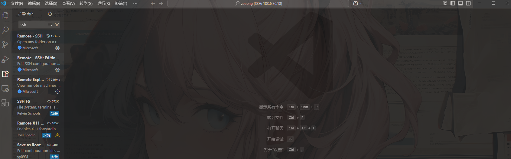

# 服务器连接

## 写在前面

众所周知，我们在训练模型需要用到大量的 GPU 所以我们一般都会租用显卡集群，实验室也一般有自己的显卡集群，但是这些 GPU 通常需要放在一个固定的机房内来满足维护和散热的需求。

那么我们可以怎么做来实现连接这些显卡来训练模型或者跑自己的东西呢？直接将自己的电脑连接到机房的机器不太现实（虽然电影里经常这么做），这时候就需要连接到机房的服务器上来进行远程的操控。

事实上，服务器作为一种远程的主机，其功能远比上面描述的要多得多，并且也有许多不同的种类。并且其中使用最为广泛的就是搭载 **Linux** 操作系统的服务器，因此学习 Linux 操作系统并且了解服务器是十分必要的。

**本文将介绍基础的 Linux 服务器知识，希望大家可以在此基础上根据自己的不同使用场景来为此文档增添内容！**

## 挑选一款合适的服务器

想要学习一个东西，最好的方法就是实践。因此拥有自己的 Linux 操作系统很有必要，在本机上安装搭载 Linux 系统的虚拟机可以看本目录下的其他文档。在此仅介绍 Linux 系统在服务器上的表现。

国内很多大厂都有自己的服务器服务，这里以[阿里云](https://www.aliyun.com/product/ecs?spm=5176.30371578.nav-v2-dropdown-menu-1.d_main_0_0.5421154aZwGPMq\&scm=20140722.M_ecs.P_104.ID_ecs-OR_rec-PAR1_213e369a17578526332153474e3c60-V_1-MO_3480-ST_13051)的服务器为例。

阿里云服务器目前有两种：

* **ECS 云服务器：** 也叫弹性（**E**lastic）云服务器，因为你可以根据自己在不同时期的需求来更改服务器的配置。
* **轻量应用服务器：** 这个服务器更加适合个人用户使用，日常的基础任务可以完成，但是灵活性不如 ECS 云服务器，并且大部分的配置和可操作性相对较弱，但是相比之下胜在性价比，而且如果是为了学习服务器和 Linux 操作系统，那么已经足够满足需求。

服务器通常配置信息为 $n$ **核** $n$ **G**。前者指的是服务器CPU的物理核心数量,代表了服务器的并发处理能力。后者指的是服务器**内存**大小，这个就和我们的电脑很像了。

在阿里云服务器租用时，通常你会看到这样的界面：

<figure><figcaption></figcaption></figure>

为什么平时我们的电脑动不动就 16G、32G 的运行内存，而这里的服务器只需要这么点。其实就是服务器的好处之一，特别是 Linux 的服务器。

* 我们的电脑为了更好的实现和用户的交互，设计了很多图形化的界面以及各种后台程序来保证用户使用的便捷和流畅。
* 但是 Linux 服务器追求的是效率、稳定和资源利用率的最大化。纯粹的命令行控制（现在也有很多图形化 Linux 交互界面，可以自己寻找合适的）不需要那么多资源来运行这些界面的程序，因此在这个方面对内存的要求并不高。

在轻量应用服务器和 ECS 云服务器之间挑选一个价格合适的、自己喜欢的即可（一般是100￥以内一年，轻量应用服务器更便宜点），2核2G已经够用。

**但是要注意的是：** 这些服务器都是**没有显卡**的，有显卡的就是另一个价格了，贵的可怕，因为注重的是 Linux 服务器的基础内容，供初始学习，所以就先不进行扩展，可以期待后续内容。

`Tips:` 以下内容均基于 `Ubuntu 22.04` 系统，其它系统可以自行搜索相关教程，但是大体方向不变。

## 一、如何连接服务器

### 服务器基本信息

一般服务器信息包含

```bash
4090服务器
IP：      # 获得的公网ip地址
端口：    # 默认为 22
用户名：  # 默认为 root
密码：
```

### 终端 SSH 连接

`Tips:` win 10 以上的 PowerShell 终端命令行工具已兼容 SSH 连接，但是也可以使用其他更加适配 Linux 服务器的第三方终端例如：

* `PuTTY`: 最经典、小巧免费的 SSH 客户端。您需要下载并运行它，在 "Host Name (or IP address)" 处输入服务器 IP，点击 "Open" 即可。
* `MobaXterm`: 功能非常强大的多合一终端工具，除了 SSH，还集成了 SFTP 文件浏览器、X11 转发等功能，非常适合开发者和系统管理员。
* `Xshell`: 另一款功能丰富的商业软件（对家庭和学校用户免费），以其优秀的会话管理和易用性著称。

但还是建议使用非窗口化的命令行工具，这样可以更利于我们的学习。如果你是使用 macOS 操作系统的，那么就不需要安装这些第三方终端工具了，mac 自带的终端已经可以完全兼容 Linux 的各种指令。

对 SSH 这个东西感兴趣的也可以自行搜索，很有用。

SSH 连接指令为：

```bash
ssh 用户名@ip地址 -p 端口号
# 例：ssh root@114.514.666.111 
# (默认端口为 22 就可以不填，为什么是 root 可以先看下面)
```

接着输入密码即可

#### 免密登录

***

在观看这一部分内容前建议先跳转至[用户管理](fu-wu-qi-lian-jie.md#用户管理)，了解相关内容！

我们如果每次登录服务器都要输入密码对于我这种懒人肯定不太友好那可不可以免密呢？当然可以首先我们需要生成密钥对。密钥对包含公钥和私钥，我们需要将公钥上传到服务器保存，私钥保存在本地，**私钥非常重要！请务必妥善保管！**

```bash
ssh-keygen -t rsa -b 4096 
# 现在更多使用 ed25519 算法来进行密钥的生成，可以询问大模型相关内容
```

然后系统会询问你两次，一次是保存地址，另一次是访问密钥的密码。这里一直 `Enter` 就行。

接着把公钥上传到服务器，通常公钥文件以 `.pub` 后缀结尾，

```bash
ssh-copy-id 用户名@ip地址
# win 系统终端 powershell可能没有这个命令，如果有 git 可以换成 git bash 终端。对于 macOS 操作系统可以正常运行。
```

系统会提示你输入该用户在 Linux 服务器上的登录密码。这是最后一次需要你输入密码了

命令会自动将你的公钥内容追加到服务器的 `~/.ssh/authorized_keys` 文件中，并设置好正确的权限，然后指令和ssh一样就可以免密登录了。

当然你也可以自己手动复制公钥内容到服务器，但是这个操作需要对 Linux 系统有一定的了解并且掌握编辑器 `Vim` 的一定使用方法才不容易出错，在此不过多介绍，愿意了解的可以自行搜索或者询问大模型相关问题（~~其实是笔者怕讲错~~）

#### VScode集成终端连接

* 拓展搜 SSH Remote

<figure><figcaption></figcaption></figure>

* 添加服务器(右上角加号)

<figure><figcaption></figcaption></figure>

* 然后输入ssh指令就会自动给你配置到setting.json中就能连接成功了

### 用户管理

在我们自己的电脑上可能会有一个或多个用户，Linux 服务器也不例外。Linux 系统支持多个用户登录，前面提到的 `root` 用户就是一个 Linux 操作系统中最高权限的管理员。

在这个 `root` 用户下操作非常的方便，因为不需要考虑任何权限问题，但是伴随而来的就是安全性问题。在这个超级管理员权限下的任何操作都有可能直接威胁 Linux 系统的安全，因此非常建议设置自己的普通用户，并且通过普通用户来进行操作。

在开始操作前，我们先理解几个基本概念：

* **用户 (`User`):**

Linux 是一个多用户操作系统，每个可以登录系统并执行操作的实体就是一个“用户”。

* **用户组 (Group):**

用户组是用户的集合。通过将用户放入特定的组，我们可以方便地**为一组用户统一分配文件权限或执行权限**。

* **主组 ( Primary Group ) 与 附加组 ( Secondary Group ):**

**每个用户必须属于一个“主组”**。通常在创建用户时，系统会自动创建一个**与用户名同名**的组作为其主组。 一个用户可以同时属于多个“附加组”。 将一个普通用户添加到这个特定的 `sudo` 组里，就赋予了该用户执行 `sudo` 命令的权力。

#### 添加你的普通用户

1. 首先，你需要登录到你的服务器。如果你当前不是 root 用户，请使用以下命令切换到 root。系统会提示你输入 root 用户的密码。

```bash
su -
```

2. 我们使用 adduser 命令来创建新用户。这是一个非常友好的交互式脚本，它会自动处理很多细节。

```bash
adduser username  # 你的用户名 
```

3. 将用户添加到 `sudo` 组（用户组），也就是让你的这个普通用户在需要时有权调用 `root` 这个超级管理员。

`sudo` = "**SuperUser DO**"

```bash
usermod -aG sudo username
```

命令解析：

* usermod: 修改用户账户的命令。
* -a: append (追加) 的意思。这个参数非常重要！ 它表示将用户“追加”到指定的组中，而不是替换掉用户已有的附加组。如果省略 -a，用户将被从其他所有附加组中移除。
* -G: 指定要添加到的附加组（Secondary Group）。

**4. 验证操作是否成功** 现在，我们需要确认用户 `username` 确实已经被添加到了正确的组中。

可以使用 `groups` 命令来查看：

```bash
groups username
```

预期输出:

```bash
username : username sudo
这表明 username 的主组是 username，附加组是 sudo。
```

**5. 测试 `sudo` 权限：** 从 `root` 切换为普通用户 `username`

```bash
su - username
```

尝试执行一个特权命令，比如更新软件包列表。在命令前加上 `sudo` ; 当你第一次在这个会话中使用 `sudo` 时，系统会提示你输入 `username` 用户自己的密码（而不是 `root` 的密码）来进行验证。

如果命令成功执行，没有任何 "not in the sudoers file" 之类的错误信息,那么就算成功创建普通用户！

### 可供自学的文章与教程

* [韩顺平 2018 Linux 学习笔记](https://github.com/Sunxz007/Linux-note-follow-Hanshunping)
* [韩顺平 2021 Linux 学习笔记](https://blog.csdn.net/zhangyifeng_1995/article/details/128485382)
* [韩顺平 Linux 配套b站课程](https://www.bilibili.com/video/BV1Sv411r7vd/?vd_source=7151b4d70d06f51086869a0d62b76801)
* [Liunx Tutorial 命令，运营与维护](https://github.com/dunwu/linux-tutorial)
* [Linux 教程笔记](https://zq99299.github.io/linux-tutorial/)
