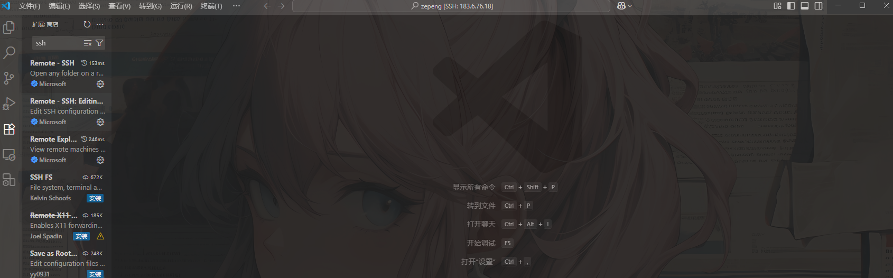

# 写在前面

众所周知，我们在训练模型需要用到大量的 GPU 所以我们一般都会租用显卡集群，实验室也一般有自己的显卡集群，但是这些 GPU 通常需要放在一个固定的机房内来满足维护和散热的需求。

那么我们可以怎么做来实现连接这些显卡来训练模型或者跑自己的东西呢？直接将自己的电脑连接到机房的机器不太现实（虽然电影里经常这么做），这时候就需要连接到机房的服务器上来进行远程的操控。

事实上，服务器作为一种远程的主机，其功能远比上面描述的要多得多，并且也有许多不同的种类。并且其中使用最为广泛的就是搭载 **Linux** 操作系统的服务器，因此学习 Linux 操作系统并且了解服务器是十分必要的。

**本文将介绍基础的 Linux 服务器知识，希望大家可以在此基础上根据自己的不同使用场景来为此文档增添内容！**

# 挑选一款合适的服务器

想要学习一个东西，最好的方法就是实践。因此拥有自己的 Linux 操作系统很有必要，在本机上安装搭载 Linux 系统的虚拟机可以看本目录下的其他文档。在此仅介绍 Linux 系统在服务器上的表现。

国内很多大厂都有自己的服务器服务，这里以[阿里云](https://www.aliyun.com/product/ecs?spm=5176.30371578.nav-v2-dropdown-menu-1.d_main_0_0.5421154aZwGPMq&scm=20140722.M_ecs.P_104.ID_ecs-OR_rec-PAR1_213e369a17578526332153474e3c60-V_1-MO_3480-ST_13051)的服务器为例。

阿里云服务器目前有两种：
- **ECS 云服务器：** 也叫弹性云服务器，因为你可以根据自己在不同时期的需求来更改服务器的配置。
- **轻量应用服务器：** 这个服务器更加适合个人用户使用，日常的基础任务可以完成，但是灵活性不如 ECS 云服务器，并且大部分的配置和可操作性相对较弱，但是相比之下胜在性价比，而且如果是为了学习服务器和 Linux 操作系统，那么已经足够满足需求。

服务器通常配置信息为 $n$ **核** $n$ **G**。前者指的是服务器CPU的物理核心数量,代表了服务器的并发处理能力。后者指的是服务器**内存**大小，这个就和我们的电脑很像了。

在阿里云服务器租用时，通常你会看到这样的界面：
<figure><figcaption></figcaption></figure>

为什么平时我们的电脑动不动就 16G、32G 的运行内存，而这里的服务器只需要这么点。其实就是服务器的好处之一，特别是 Linux 的服务器。

- 我们的电脑为了更好的实现和用户的交互，设计了很多图形化的界面已经各种程序来保证用户使用的便捷和流畅。

- 但是 Linux 服务器追求的是效率、稳定和资源利用率的最大化。纯粹的命令行控制（现在也有很多图形化 Linux 交互界面，可以自己寻找合适的）不需要那么多资源来运行这些界面的程序，因此在这个方面对内存的要求并不高。

所以挑选一个价格合适的即可（一般是100￥以内一年），2核2G已经够用。

**但是要注意的是：** 这些服务器都是**没有显卡**的，有显卡的就是另一个价格了，贵的可怕，因为注重的是 Linux 服务器的基础内容，供初始学习，所以就先不进行扩展，可以期待后续内容。


# 服务器连接

一般服务器信息包含

```
4090服务器
IP：
端口：
用户名：
密码：
```

**终端SSH连接**

指令为

```
ssh 用户名@ip地址 -p 端口号
```

接着输入密码即可

**免密登录**

我们如果每次登录服务器都要输入密码对于我这种懒人肯定不太友好那可不可以免密呢？当然可以首先我们需要生成密钥对

```bash
ssh-keygen -t rsa -b 4096
```

接着呢把密钥对上传到服务器

```bash
ssh-copy-id -p 端口号 用户名@ip地址
```

然后指令和ssh一样就可以免密登录了

**Vscode连接**

* 拓展搜 SSH Remote

<figure><figcaption></figcaption></figure>

* 添加服务器(右上角加号)

<figure><figcaption></figcaption></figure>

* 然后输入ssh指令就会自动给你配置到setting.json中就能连接成功了
