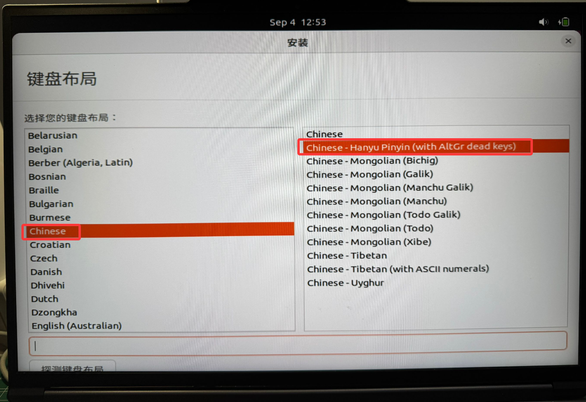

# Linux双系统安装

#### 双系统相比虚拟机的好处在于可以使用GPU加速

**1 电脑分区**

* 下载图吧工具箱
<https://www.tubatool.com/>,在磁盘工具中找到DiskGenius

<figure><figcaption></figcaption></figure>

* 选择一个想要被分的盘，新建分区

<figure><figcaption></figcaption></figure>

* 分区后部的空间填入你想要分配给Linux的空间
（建议&gt;500,&lt;700），选择建立新分区

<figure><figcaption></figcaption></figure>

* 分区完成

<figure><figcaption></figcaption></figure>

* 删除分区，得到空闲区域

<figure><figcaption></figcaption></figure>

<figure><figcaption></figcaption></figure>

**2 下载ubuntu的iso文件**
* <https://releases.ubuntu.com/22.04.4/>
电脑是amd64架构的，下载以下这个

<figure><figcaption></figcaption></figure>

**3 制作启动盘**

* 下载UltraISO
<https://ultraiso.net/xiazai.html>,使用免费试用版本
选择U盘

<figure><figcaption></figcaption></figure>

<figure><figcaption></figcaption></figure>

* 点击左上角文件，打开，选择iso文件

* 点击启动，写入硬盘映像

<figure><figcaption></figcaption></figure>

<figure><figcaption></figcaption></figure>

**4 设置中取消设备加密**

<figure><figcaption></figcaption></figure>

**5 安装Ubuntu**

* 插上U盘，重启电脑，进入BIOS
不同电脑进入方式不同，不知道的可以找个购物平台同型号的问一下客服，以下也有一些常见的进入方式

<figure><figcaption></figcaption></figure>

* 进入BIOS后，找到Security或Boot里的Secure Boot，设为Disabled

<figure><figcaption></figcaption></figure>

* 在Boot里将Boot Option1设为启动盘，一般名字带有USB Key

<figure><figcaption></figcaption></figure>

* 根据按键指示Save & Reset

<figure><figcaption></figcaption></figure>

* 重启后，选择Try or Install Ubuntu，按enter

<figure><figcaption></figcaption></figure>

* 下划选择中文（简体），安装Ubuntu

<figure><figcaption></figcaption></figure>

* 键盘布局，选择Chinese，Chinese-Hanyu Pinyin（with AltGr dead keys）

<figure><figcaption></figcaption></figure>

* 选择网络（安装过程中不要断网）

<figure><figcaption></figcaption></figure>

* 如果找不到“继续”，按Alt+F7后移动鼠标，拖动页面

<figure><figcaption></figcaption></figure>

<figure><figcaption></figcaption></figure>

* 选择正常安装，其他选项都勾选上

<figure><figcaption></figcaption></figure>

* 安装类型选择其他选择

<figure><figcaption></figcaption></figure>

* 点击空闲，“+”号，创建第一个分区，大小500MB，用于EFI系统分区

<figure><figcaption></figcaption></figure>

* 创建第二个分区，大小为（内存\*1000）MB，用于交换空间

<figure><figcaption></figcaption></figure>

* 创建第三个分区，大小为你的ubuntu系统总空间的四分之一存储
（G到MB换算乘1000），用于Ext4 日志文件系统，挂载点：/

<figure><figcaption></figcaption></figure>

* 创建第四个分区，大小为剩余所有空间，用于Ext4 日志文件系统，挂载点：/home

<figure><figcaption></figcaption></figure>

* 找到efi分区对应的编号，在安装启动引导器的设备中选择它

<figure><figcaption></figcaption></figure>

* 继续，确定一下四个分区是否正确

<figure><figcaption></figcaption></figure>

* 地区填Guangzhou

<figure><figcaption></figcaption></figure>

* 设置一下账号密码

<figure><figcaption></figcaption></figure>

* 等待

<figure><figcaption></figcaption></figure>

* 安转完毕，点击现在重启

<figure><figcaption></figcaption></figure>

* 重启后如果还是进入Windows，需要再重启进入BIOS将Boot Option1设为Ubuntu
如果Boot Option1里没有Ubuntu的选项，找一下有没有类似UEFI Hard Disk Drive BBS Priorities的选项，选择Ubuntu，之后再选Boot Option1就有了

<figure><figcaption></figcaption></figure>

<figure><figcaption></figcaption></figure>

<figure><figcaption></figcaption></figure>

#### 之后每次切换系统都需要进入BIOS切换

#### 安装失败需要重装的看一下这个卸载的视频，注意看一下是Legacy还是UEFI引导的【Windows 和 Ubuntu 双系统的安装和卸载-哔哩哔哩】 https://b23.tv/HsZpCSa